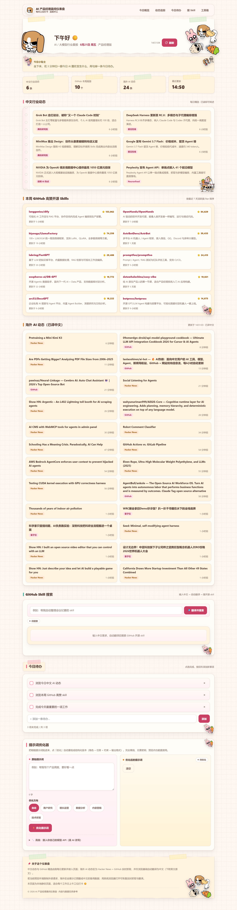

# AI 产品经理晨间仪表盘

> 一个为 AI 产品经理打造的纯静态晨间仪表盘。每天上午工位打卡时打开，几分钟内扫完行业动态、高赞开源项目，顺手规划今日待办、优化提示词，温柔开工 ☀️

线上地址：https://atuyn1007.github.io/ai-pm-morning-dashboard/



---

## ✨ 功能模块

| 模块 | 说明 |
|------|------|
| **今日概览** | 顶部统计卡片：中文动态条数、GitHub 高赞数、海外动态条数、最近更新时间。 |
| **中文行业动态** | 每日精选的 4–6 条中文 AI / 大模型行业新闻，已附来源与时间，读完即可转述。 |
| **本周 GitHub 高赞开源 Skills** | 按活跃度 / Star 排序的 Top 10 开源项目，每条含中文简介与最近更新时间。 |
| **海外 AI 动态（已译中文）** | 实时抓取 Hacker News + GitHub 热门，浏览器端自动翻译为中文（下附英文原文）；受限环境回退到内置中文备用数据。 |
| **GitHub Skill 搜索** | 输入中文需求 → 自动翻译为英文 → 检索开源 skill 仓库，适合“找现成轮子”。 |
| **今日待办** | 可勾选的 checklist，支持新增 / 删除 / 清除已完成，数据存本地浏览器。 |
| **提示词优化器** | 把粗糙提示词重组成结构化版本（角色 + 任务 + 约束 + 输出格式）。默认离线规则式、无需密钥；也可接入自己的模型 API 做真 AI 改写。 |

---

## 🛠 技术栈

纯前端、零依赖、零构建：

- **HTML** 页面结构（`index.html`）
- **CSS** 奶油粉“手帐”风格样式（`styles.css`）
- **原生 JavaScript** 数据与全部交互逻辑（`app.js`）

无框架、无打包工具、无后端。

---

## 📁 目录结构

```
.
├── index.html      页面结构
├── styles.css      奶油粉手帐风格样式
├── app.js          数据与全部交互逻辑（数据源见下）
├── assets/         贴纸与装饰图片
└── README.md
```

---

## 🔑 数据源与每日更新

需要**手动维护的数据**只有 `app.js` 顶部的两个数组，其余区块均为运行时实时或本地逻辑：

- `TODAY_NEWS`：每日精选中文 AI 行业动态（4–6 条），字段 `title / url / source / time / desc`。
- `GH_WEEKLY`：本周 GitHub 高赞开源 Skills（Top 10），字段 `name / url / stars / desc / updated`。

更新流程：

1. 编辑 `app.js` 中的上述两个数组（替换内容，不要改数组名）。
2. **只改数据**：不要改动页面结构、样式，也不要动提示词优化器、翻译或 `localStorage` 逻辑。
3. 提交并推送，线上即更新（见下方部署说明）。

> 海外动态、Skill 搜索、提示词优化器、今日待办均无需手动维护。

---

## 🚀 本地预览

无需构建，任选其一：

```bash
# 方式一：直接用浏览器打开 index.html

# 方式二：起一个本地静态服务器
python -m http.server 8080
# 然后访问 http://localhost:8080
```

> 海外动态抓取、Skill 搜索、翻译依赖浏览器跨域请求，建议用本地服务器或系统浏览器打开；部分受限预览环境会回退到内置备用数据，属正常现象。

---

## ☁️ 部署（GitHub Pages）

- **仓库**：`atuyn1007/ai-pm-morning-dashboard`
- **发布分支**：`main`（GitHub Pages 从 `main` 构建）
- **日常开发**：在 `feat/cream-pink-scrapbook-ui` 分支提交，合并前 `git merge --ff-only feat/cream-pink-scrapbook-ui` 到 `main` 再推送，线上即更新。
- **线上地址**：https://atuyn1007.github.io/ai-pm-morning-dashboard/

---

## 💾 本地存储说明

所有待办与优化器配置**仅保存在浏览器 `localStorage`，不上传任何服务器**：

| Key | 用途 |
|-----|------|
| `pm_todos` | 今日待办清单 |
| `pm_opt_base` | 提示词优化器接入自定义模型的 API Base URL |
| `pm_opt_key` | 自定义模型 API Key |
| `pm_opt_model` | 自定义模型名 |
| `pm_opt_useai` | 是否启用 AI 模型优化 |

> 接入自定义模型 API（OpenAI / DeepSeek / 通义千问 / Kimi 预设）时，密钥只存在本地浏览器，请仅在可信设备使用。

---

## 📝 版权

© 2026 AI 产品经理晨间仪表盘 · 内容与数据仅供参考。
